# Yampa Pokédex

Descubra todos os Pokémon na Yampa Pokédex! Uma experiência visual e interativa com busca inteligente, cards estilizados e rolagem infinita. Inspirado na estética dos animes, o projeto foi pensado para oferecer uma navegação fluida e rica em detalhes para fãs de todas as gerações.

🔗 **Demo**: [yampa-pokedex](https://ccqueiroz.github.io/yampa-pokedex/)

📦 **Repositório**: [github.com/ccqueiroz/yampa-pokedex](https://github.com/ccqueiroz/yampa-pokedex)

---

## ✨ Funcionalidades

- 🔍 **Busca com Autocomplete** (ordenada alfabeticamente)
- 🖼️ **Cards dinâmicos** com fundo personalizado por tipo do Pokémon
- ♾️ **Scroll infinito** com virtualização de lista
- 🌐 **Suporte a múltiplos idiomas** (Português e Inglês)
- 📱 **Responsivo** para todos os dispositivos
- 🧪 **Testes unitários** com cobertura integrada
- 📚 **Storybook** para documentação de componentes

---

## 🚀 Tecnologias

- **React 19** + **Vite**
- **MobX** para gerenciamento de estado
- **React Query** para gerenciamento de cache e requisições
- **TailwindCSS** + `clsx` + `class-variance-authority`
- **Radix UI** e **Lucide React** (componentes acessíveis)
- **React Virtual** para virtualização de listas
- **Vitest** + Testing Library para testes
- **i18next** para internacionalização

---

## 📁 Estrutura de Pastas

```bash
src/
├── app/                # Componentes principais e layout
│   ├── main/           # Entrada visual do app
│   ├── components/     # Header, PokeList, PokeCard, etc
│   └── providers/      # Contextos principais
├── assets/             # Imagens e mídias
├── config/             # Arquivos de configuração (ex: i18n)
├── domain/             # Entidades e DTOs
├── infra/              # Camada de infraestrutura (store, http)
├── lib/                # Utilitários e helpers
├── service/            # Serviços que fazem chamadas externas
├── test/               # Setup e mocks de testes
├── types/              # Tipagens globais
├── usecase/            # Casos de uso da aplicação
├── main.tsx            # Ponto de entrada
└── index.css           # Estilos globais
```

---

## 🛠️ Executando Localmente

```bash
# Instalar dependências
yarn install

# Rodar em ambiente de desenvolvimento
yarn dev

# Rodar testes
yarn test

# Rodar Storybook
yarn storybook

# Gerar cobertura de testes
yarn test:coverage

# Build para produção
yarn build
```

---

## 🧠 Arquitetura e Padrões

- **Arquitetura em Camadas**: `domain` → `usecase` → `service` → `infra`
- **Design Patterns**: Context API, Hook personalizado, Virtualização, Lazy loading
- **Boas práticas**: Separação de responsabilidade, código modular e testável
- **Aliasing**: Utiliza `@` para apontar para `src/`

---

## 📈 Cobertura de Código

Gere o relatório com:

```bash
yarn test:coverage
```

O resultado estará disponível em `/coverage/index.html`

---

## 🧪 Testes e Qualidade

- Testes unitários com **Vitest**
- Testes de UI com **Testing Library**
- Análise com **ESLint** e **React Scan**
- Documentação de componentes com **Storybook**

---

## 🌍 Internacionalização

- Configurado com **i18next** e `react-i18next`
- Detecção automática de idioma do navegador
- Botão no header para troca entre PT-BR / EN

---

## 📄 Licença

[MIT](LICENSE) © [Caio Queiroz](https://github.com/ccqueiroz)

---

## 🤝 Contribuições

Contribuições são bem-vindas! Sinta-se à vontade para abrir uma issue ou enviar um pull request com melhorias ou correções.

---

## Screenshots

### 1. Tela Inicial do Aplicativo em Português

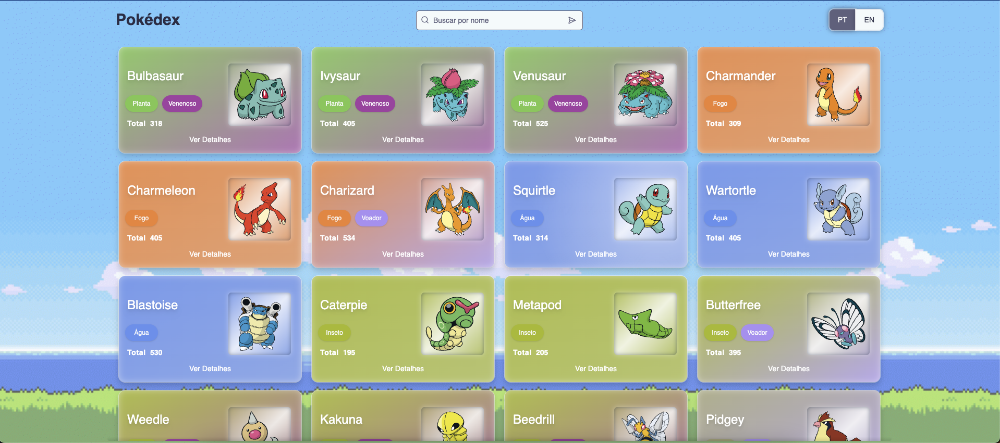

### 2. Tela Inicial do Aplicativo em Inglês

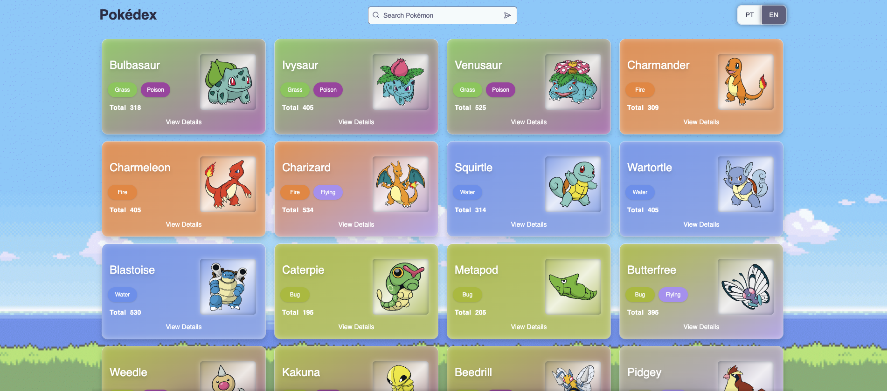

### 3. Input com Autocomplete

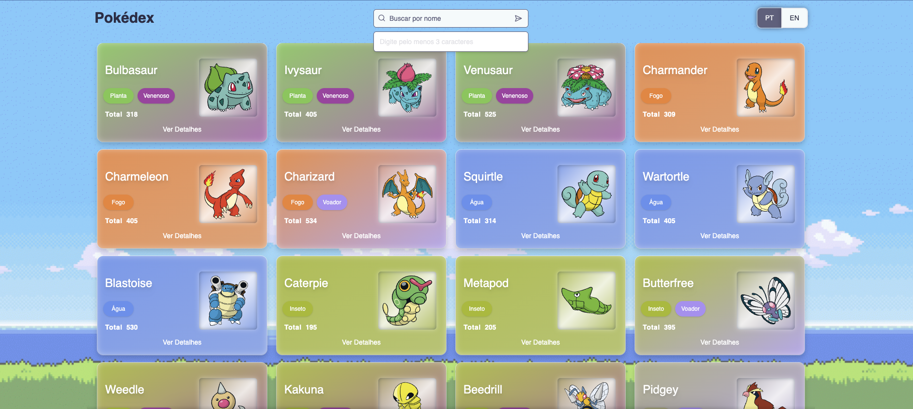

### 4. Sugestões de Pokémons com Base no Nome Digitado

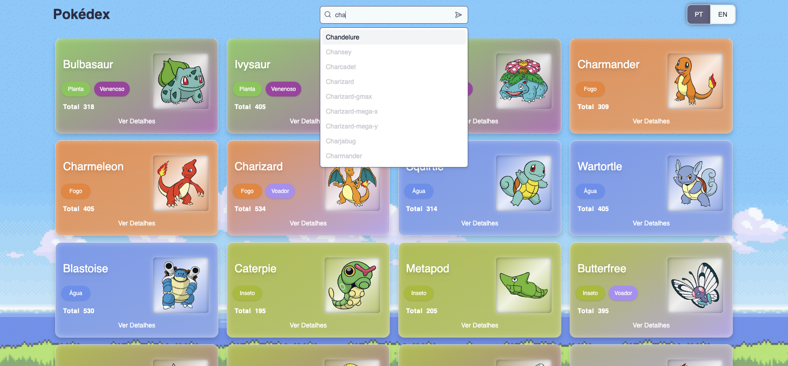

### 5. Não Foram Encontradas Sugestões de Pokémons

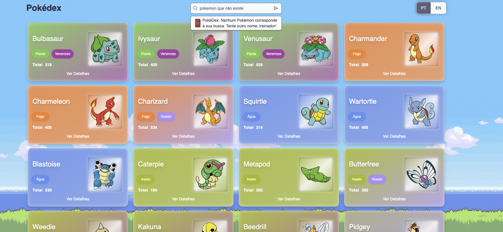

### 6. Pokémons Encontrados Pela Busca

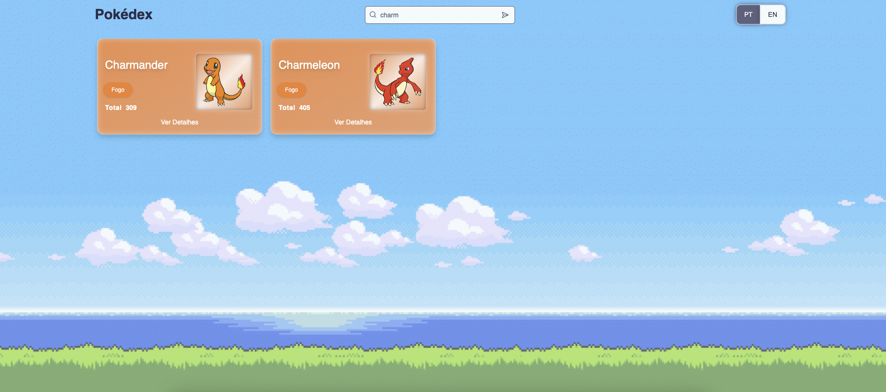

### 7. Pokémons Não Encontrados Pela Busca

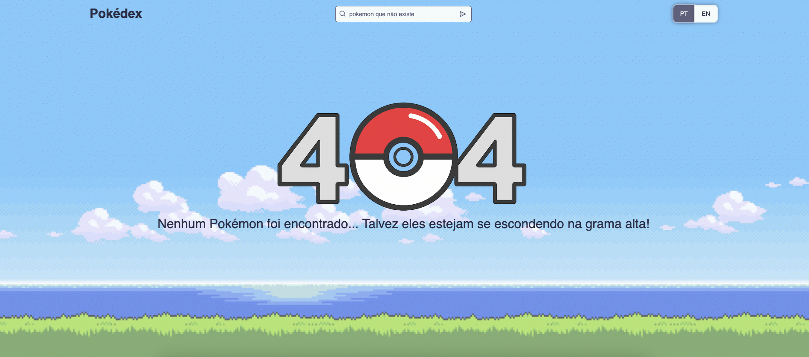

### 8. Modal Card Pokémon - Aba Status

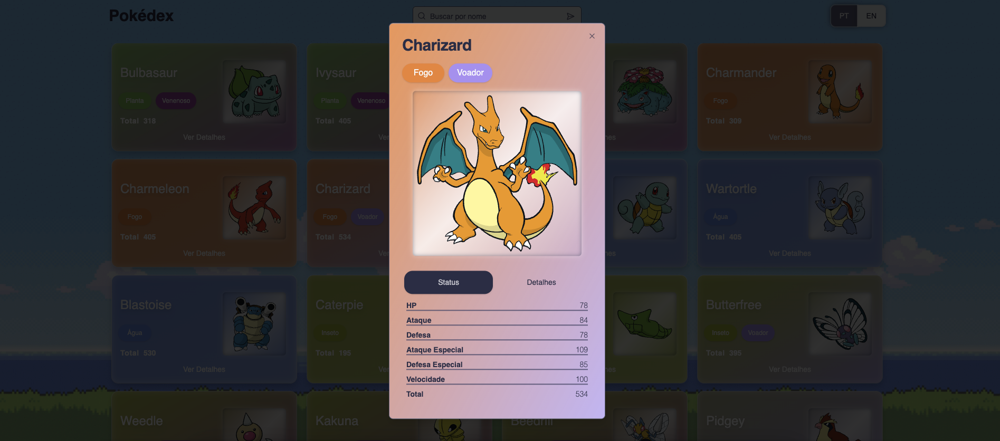

### 9. Modal Card Pokémon - Aba Detalhes

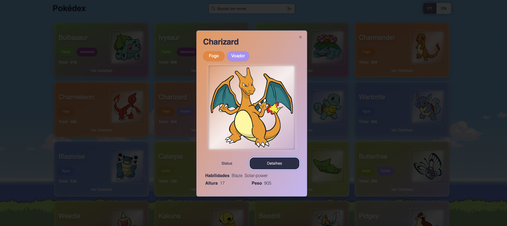

### 10. Tela Inicial Para Smartphones

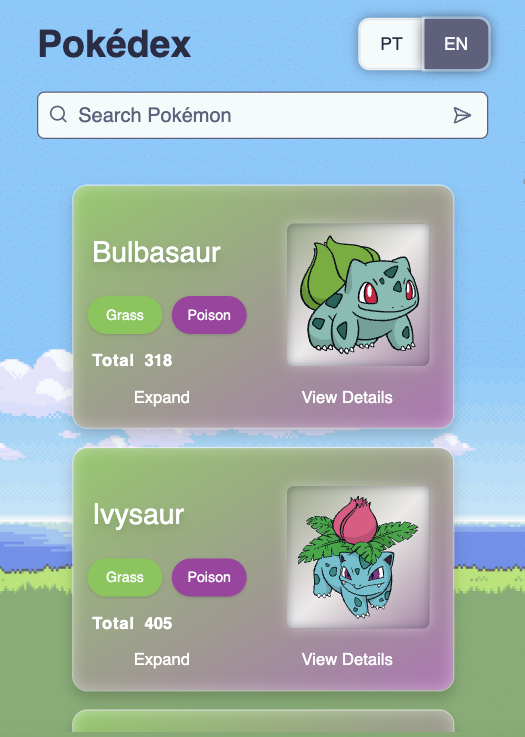

### 11. Card Pokémon com Status Visíveis

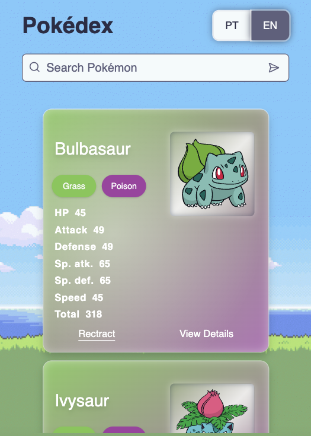

## 📬 Contato

<div style="margin-top: 15px; margin-bottom: 5px;">
    
    <br />
    <sub style="margin-left: 15px">
        <b>Caio Queiroz</b>
    </sub>
</div>

[](https://www.linkedin.com/in/caio-queiroz-83846399/)
[](mailto:caio.cezar.dequeiroz@gmail.com)

---
